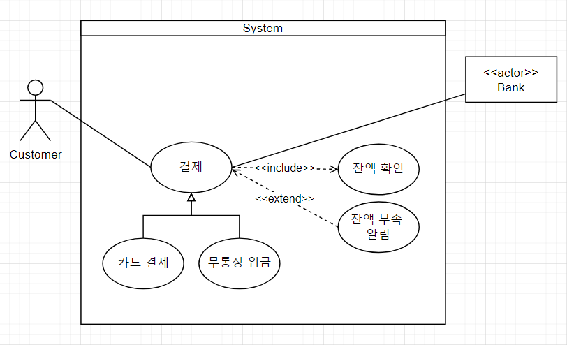

# 유즈케이스(User case)
---

## 유즈케이스(User case) 란

- 유스케이스란 **사용자(actor)가 관심을 가지고 있는 일을 달성하기 위해 시스템이 제공하는 시나리오들을 말한다.**
    - 이 시스템을 **누가**, **왜**, **어떤 순서로 쓰는가**?를 사용하는 사람의 관점에서 정리한 것이다. 즉 사용자의 관점에서 본 시스템의 기능 설명서라고 할 수있다.
   - 산출물로는 **유즈케이스 명세서, 유즈케이스 다이어그램, 유즈케이스 시나리오** 등이 있다.
  
## 유즈케이스의 목적과 중요성

1. **요구사항 명확화**
   - 시스템의 기능 요구사항을 명확하고 구체적으로 정의함으로써 사용자와 개발자가 같은 이해를 공유할 수 있게 한다.

2. **개발 과정 지원**
   - 유즈케이스는 시스템 설계, 개발, 테스트 과정에서 참고 자료로 사용되어 일관성과 정확성을 유지하는 데 기여한다.

3. **커뮤니케이션 도구**
   - 개발자, 디자이너, 테스터, 비즈니스 분석가 등 다양한 이해관계자 간의 원활한 의사소통을 돕는다.

4. **테스트 케이스 작성**
   - 유즈케이스는 테스트 케이스를 작성하는 데 중요한 기준이 되며, 시스템이 요구사항을 충족하는지 검증하는 데 사용된다.

---

## 유즈케이스의 주요 요소

1. **유즈케이스**
   - Actor가 시스템을 통해 달성하려는 목표

2. **행위자 (Actor)**
   - 시스템과 사용하는 외부 주체를 말한다.
     - **사람**: 사용자, 관리자, 고객
     - **시스템**: 결제 API, 인증서버
3. **시나리오**
   - 유즈케이스 목표를 달성하기 위한 **구체적인 흐름**
   - **주요 흐름 (Main Flow)**
     - 유즈케이스가 정상적으로 진행되는 기본 시나리오를 단계별로 서술한다.
   - **대체 흐름 (Alternative Flow)**
     - 주요 흐름과 다른 상황에서 진행되는 대체 시나리오를 설명한다
   - **예외 흐름 (Exception Flow)**
     - 에러나 예외 상황에서의 흐름을 서술한다.

---

## 유즈케이스 산출물
- **유즈케이스 명세서(정의서)**
    - 유즈케이스 별로 액터로 부터 시작하여 기능이 실행되는 일련의 흐름을 문서로 작성한 것.

- **유즈케이스 다이어그램**
  - **시스템과 사용자간의 상호작용을 다이어그램으로 표현 한 것**으로 사용자 관점에서 시스템의 기능/서비스와 그와 관련된 외부 요소와의 관계를 보여준다.
  

---

# 유즈케이스 명세서 예

## 로그인 유즈케이스

**유즈케이스 이름:** 로그인    
**목적:** 사용자가 시스템에 접근하기 위해 로그인한다.    
**주요 행위자:** 사용자      
**사전 조건:** 사용자는 유효한 사용자 계정과 비밀번호를 가지고 있어야 한다.     
**사후 조건:** 사용자는 시스템에 로그인되어 있으며, 메인 화면으로 이동된다.    

**주요 흐름:**
  1. 사용자는 로그인 페이지를 연다.
  2. 사용자는 사용자 이름과 비밀번호를 입력한다.
  3. 사용자는 '로그인' 버튼을 클릭한다.
  4. 시스템은 사용자 이름과 비밀번호를 검증한다.
  5. 시스템은 사용자를 메인 화면으로 이동시킨다.

**대체 흐름:**
  - **2a. 비밀번호 찾기:**
    -  만약 사용자가 비밀번호를 잊어버린 경우, '비밀번호 찾기' 버튼을 클릭하여 비밀번호 재설정을 진행한다.

**예외 흐름:**
  - **4a. 로그인 실패:** 
    - 입력된 사용자 이름이나 비밀번호가 유효하지 않은 경우, 시스템은 오류 메시지를 표시하고 로그인 페이지에 머무른다.

**특별 요구사항:**
  - 로그인 시도는 보안 이유로 5회 실패 시 일시적으로 계정이 잠긴다.

---

# 결제 처리 유즈케이스 명세서

**유즈케이스 이름:** 결제 처리

**목적:** 사용자가 선택한 상품에 대해 결제를 완료하여 구매를 확정한다.

**주요 행위자:** 
- **사용자**: 시스템에서 상품을 구매하려는 주체
- **결제 시스템**: 결제를 처리하는 외부 시스템

**사전 조건:**
- 사용자가 구매할 상품을 선택하고 장바구니에 담아둔다.
- 사용자는 시스템에 로그인되어 있다.

**사후 조건:**
- 결제가 성공적으로 완료되면, 주문이 생성되고 결제 확인 이메일이 발송된다.
- 결제가 실패하면, 사용자는 결제 실패 메시지를 받고 결제 페이지에 머무른다.

**주요 흐름 (Main Flow):**
  1. 사용자는 장바구니 페이지에서 '결제하기' 버튼을 클릭한다.
  2. 시스템은 사용자를 결제 정보 입력 페이지로 이동시킨다.
  3. 사용자는 결제 정보를 입력하고 '결제 완료' 버튼을 클릭한다.
  4. 시스템은 결제 시스템에 결제 요청을 보낸다.
  5. 결제 시스템은 결제를 처리하고 결과를 시스템에 반환한다.
  6. 시스템은 결제가 성공적으로 완료되었음을 사용자에게 알린다.
  7. 시스템은 주문을 생성하고 결제 처리 확인 이메일을 사용자에게 발송한다.
  8. 사용자는 주문 확인 페이지로 이동된다.

**대체 흐름 (Alternative Flow):**
- **2a.** 결제 도중 장바구니로 이동을 클릭하면 장바구니 화면으로 이동한다.

**예외 흐름 (Exception Flow):**
   - **5a. 결제 정보 검증 실패:**
      1. 시스템이 결제 정보를 검증하는 과정에서 오류가 발생하면, 사용자에게 오류 메시지를 표시한다.
      2. 사용자는 결제 정보를 수정하고 다시 시도한다.

**특별 요구사항 (Special Requirements):**
- 모든 결제 정보는 전송 중에 SSL을 사용하여 암호화되어야 한다.
- 시스템은 결제 실패 시도 횟수를 기록하고, 일정 횟수 이상 실패 시 사용자의 계정을 일시적으로 잠글 수 있어야 한다.
- 결제 과정은 3초 이내에 완료되어야 한다.
