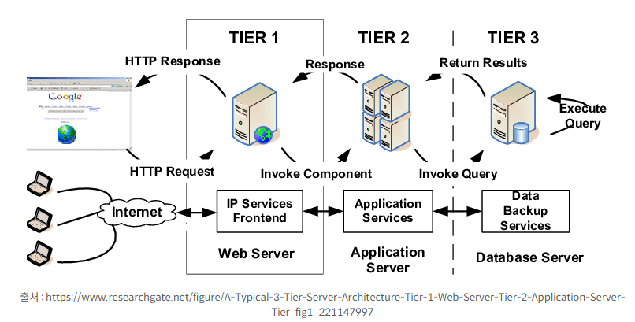
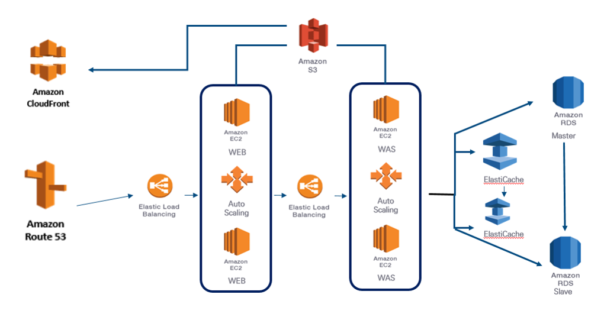

# 시스템 구성도(System Architecture Diagram)

---
# 시스템 구성도란

- 시스템 구성도(System Architecture Diagram)란, 전체 시스템의 구성 요소(서버, DB, 네트워크 등)와 이들 간의 상호작용을 시각적으로 표현한 다이어그램이다.
- 시스템 구성도를 통해 시스템의 상호 의존관계, 데이터 흐름, 보안 계층 등을 한눈에 파악할 수 있다.

## 시스템 구성도를 작성 방법

- 목적 및 범위 설정
    - 시스템 구성도를 누가(개발자, 운영팀, 관리자 등) 어떤 목적으로 사용할 것인지 정의한다.
    - 그것에 맞춰 시스템 환경을 구성할 지를 결정할 수있다.

- 주요 구성 요소 식별
    - 클라이언트(웹/모바일), 서버, 데이터베이스, 로드밸런서, 외부 API 등 필요한 컴포넌트를 나열한다.

- 상호작용 및 데이터 흐름 정의
    - HTTP **통신**인지, REST API 통신인지, 메시지 큐 기반인지 등 구성 요소들 간의 데이터 흐름을 화살표나 라벨로 표현한다.
    - 3티어(3-tier) 아키텍처예
        - 웹(프론트엔드) → 애플리케이션(백엔드) → DB(데이터베이스) 순으로 흐름을 나타낸다.

        

## 다이어그램  작성 도구
- [Lucidchart](https://www.lucidchart.com/pages/), [Draw.io](https://app.diagrams.net/), [Microsoft Visio](https://www.microsoft.com/ko-kr/microsoft-365/visio/flowchart-software/) 같은 다이어그램 도구들을 활용한다.
- [UML](https://wikidocs.net/214896), [AWS Architecture Icons](https://aws.amazon.com/ko/architecture/icons/) 등의 표준 방식을 활용하면 협업과 유지보수가 용이하다.

- 시각적 구조 구성
    - 보통 네트워크 경계를 사각형이나 구역으로 구분하고, 서버는 사각형, 데이터베이스는 원통형 아이콘, 데이터 흐름은 화살표로 표시한다.
    - 보안 계층(방화벽, VPN 등)은 별도의 존(Zone)으로 분리하여 명확하게 표현하는 것이 좋다.

---
## 예
### AWS 아키텍처 다이어그램 예시

 참조: https://jesuisjavert.github.io/2021/03/11/django-vue-aws 

---

### Django Application Architecture

